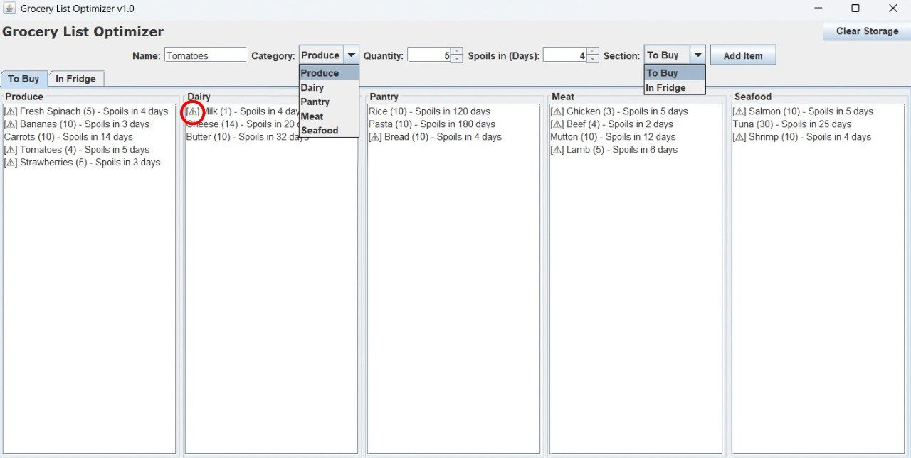
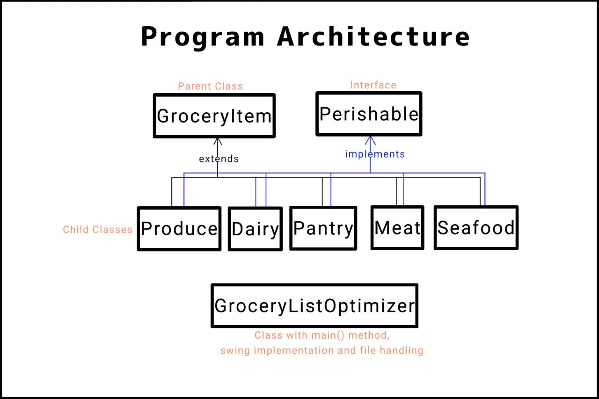

# Grocery List Optimizer

A Java Swing desktop application designed to categorize, manage, and optimize grocery inventory across purchasing and storage states.

---

## Operations Overview

### Dual-State Inventory Management

* **To Buy Section:** Tracks items and required quantities that need to be acquired during shopping.
* **In Fridge Section:** Monitors stored food items, tracking active quantities and remaining days before spoilage.

### Categorization & Spoilage Tracking

* **Aisle Categorization:** Sorts items across five core food groups: Produce, Dairy, Pantry, Meat, and Seafood.
* **Automated Spoilage Warning:** Evaluates remaining shelf life and automatically assigns a warning indicator (`[A]`) to items spoiling in 7 days or fewer.
* **Interactive Free Edit Mode:** Provides a manual override mode enabling users to edit or clear text areas directly while persisting changes to disk.

---

## Application Interface Preview

*Graphical interface displaying category panels, item input controls, tabbed inventory views, and active spoilage warning indicators.*

---

## Software Architecture

The application is structured around fundamental OOP concepts, utilizing an abstract parent class, an interface for perishable behavior, and concrete child classes for food categories.

### Core Classes and Modules

| Module / Class | Component Type | Source Files | Description |
| :--- | :--- | :--- | :--- |
| **GroceryItem** | Abstract Class | `GroceryItem.java` | Base parent class defining core fields (`name`, `quantity`) and abstract contract methods (`getLocation()`, `getAisleCategory()`, `getInfo()`). |
| **Perishable** | Interface | `Perishable.java` | Behavioral interface enforcing implementation of shelf-life tracking (`getDaysUntilSpoiled()`). |
| **Category Classes** | Concrete Classes | `Produce.java`, `Dairy.java`, `Pantry.java`, `Meat.java`, `Seafood.java` | Subclasses extending `GroceryItem` and implementing `Perishable` to manage category-specific attributes and tab placement. |
| **GroceryListOptimizer** | GUI & Driver | `GroceryListOptimizer.java` | System entry point containing the `main()` method, Java Swing interface setup, polymorphic object creation, input validation, and local file I/O operations. |

---

## Technical Specifications & Input Validation

The system enforces strict input boundaries through UI controls to maintain data consistency:

* **Item Name Field:** Text field capped at a default maximum length of 24 characters.
* **Category Selector:** Dropdown menu supporting `Produce`, `Dairy`, `Pantry`, `Meat`, and `Seafood`.
* **Quantity Spinner:** Numerical input constrained within a range of `1` to `1000` units.
* **Spoilage Window Spinner:** Numerical input tracking remaining days until expiration, constrained from `0` to `1461` days (up to 4 years).
* **Spoilage Threshold:** Automatic warning flag (`[A]`) triggered when remaining days ≤ 7.

---

## Data Persistence & File Handling

All list states are written directly to disk to maintain continuity across application sessions:

1. **Write Operations:** Adding items appends structured string representations into dedicated storage files based on category and target section.
2. **Read Operations:** On startup or tab switching, stored text files are parsed and loaded into their respective UI display areas.
3. **Manual Synchronization:** Toggling Free Edit mode enables raw text manipulation in the GUI display pane. Stopping edit mode flushes edited content directly to storage files.

---

## Conclusion

The Grocery List Optimizer helps users easily organize their grocery lists, track items they need to buy, manage items stored in the fridge, monitor quantities and shelf life, and identify food that is close to spoiling, making grocery management more organized and helping reduce food waste.
